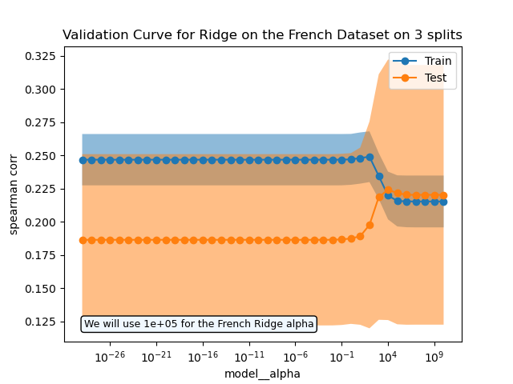
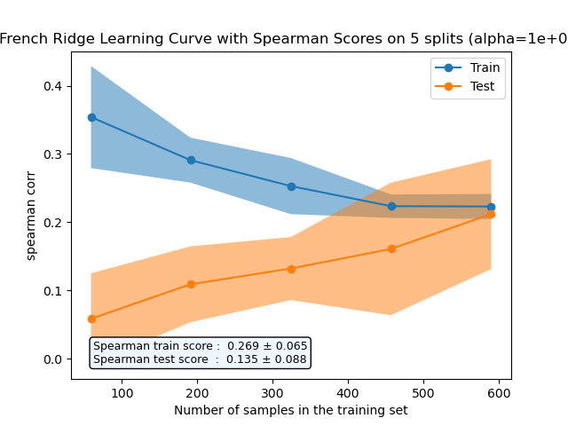
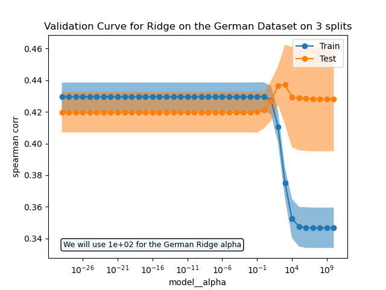
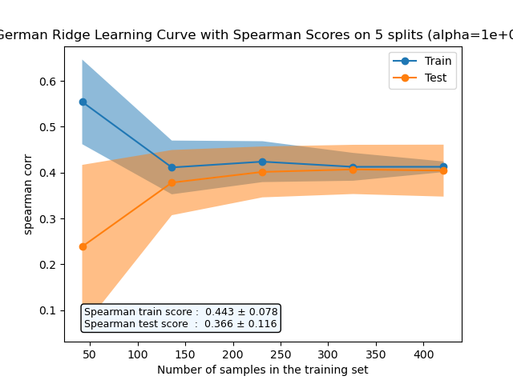
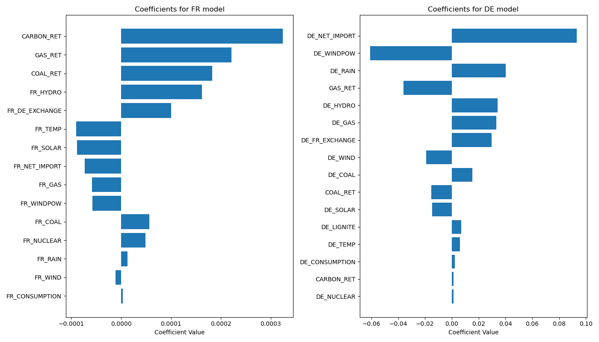

## Analysis of "How to explain electricity price?" Challenge

### Table of Contents
1. Introduction
2. Background
3. Data Overview
4. Preprocessing Steps
5. Model Overview
6. Visualizations
7. Conclusion
8. Key Insights & Observations
9. Performance Metrics

### Introduction

This report is an analysis of the challenge named "How to explain electricity price?" hosted by Qube Research and Technology on challengedata.ens.fr. The challenge focuses on modeling the daily variation in electricity prices based on meteorological, energy, and commercial data for two European countries - France and Germany. In particular, the challenge is to explain price changes with other simultaneous variables rather than just predicting them.

In evaluating the performance of the models submitted for this challenge, the primary metric employed is the Spearman rank correlation. This non-parametric measure assesses the monotonic relationship between the predicted and actual values. Given the volatile nature of electricity prices, the Spearman correlation is particularly apt as it emphasizes the order or ranking of data rather than their absolute values. This approach ensures a robust assessment against outliers and provides a more holistic view of a model's capability to capture the underlying trends in price changes.

Predicting and understanding electricity prices is crucial for both producers and consumers. For producers, it can guide production schedules and hedging strategies, while for consumers, it can inform purchasing decisions and budgeting. This challenge provides a platform to explore this complex problem and derive insights using a variety of data sources.

### Data Overview

The dataset comprises several variables:

- `COUNTRY`: Indicates the country for which the data is recorded (France or Germany).
- `DE_CONSUMPTION` and `FR_CONSUMPTION`: Represent the consumption of electricity in Germany and France, respectively.
- `DE_FR_EXCHANGE` and `FR_DE_EXCHANGE`: Denote the electricity exchange between Germany and France.
- `DE_NET_EXPORT` and `FR_NET_EXPORT`: Illustrate the net export of electricity from Germany and France, respectively.
- `DE_NET_IMPORT` and `FR_NET_IMPORT`: Show the net import of electricity to Germany and France, respectively.
- Various forms of energy production in each country are represented by variables such as `DE_GAS`, `FR_GAS`, `DE_COAL`, `FR_COAL`, and so on.
- Meteorological data for each country, including `DE_RAIN`, `FR_RAIN`, `DE_WIND`, `FR_WIND`, `DE_TEMP`, and `FR_TEMP`.
- Return rates for different energy types are represented by `GAS_RET`, `COAL_RET`, and `CARBON_RET`.
- `TARGET`: The target variable, representing the daily variation in electricity price.

### Preprocessing Steps
- Handling missing values: [Brief description]
- Feature engineering: [Brief description]
- Normalization: [Brief description]

### Model Overview

A grid search was conducted to identify the best models for France and Germany. The results indicated that the Ridge regression model was optimal for both countries. 

To fine-tune these models, validation curves were utilized, which assisted in selecting the best hyperparameters for each model. Following this, a custom model, named `CountryBasedEstimator`, was developed. This model, depending on the country of the record (France or Germany), directs the data to the respective trained Ridge model for prediction.

### Visualizations

#### French Data Analysis

**Validation Curve**

This validation curve represents the hyperparameter tuning phase for the Ridge model on the French dataset:

**Learning Curve**

Here's the learning curve for the French dataset, generated using the Ridge regression model:

#### German Data Analysis

**Validation Curve**

Below is the validation curve for the German dataset, highlighting the hyperparameter optimization:

**Learning Curve**

The following image showcases the learning curve for the German dataset, again with the Ridge regression model:

### Conclusion

**French Model Analysis:**
1. `CARBON_RET`, `GAS_RET`, and `COAL_RET` have the most positive influence on the electricity price in France. This suggests that as the returns from carbon, gas, and coal increase, the electricity price also tends to rise.
2. On the contrary, `FR_TEMP`, `FR_SOLAR`, and `FR_NET_IMPORT` have the most negative influence. This could indicate that higher temperatures, increased solar energy production, and a higher net import of electricity lead to a decrease in electricity price.
3. Other factors such as `FR_HYDRO` and `FR_DE_EXCHANGE` also have a positive effect, while `FR_GAS` and `FR_WINDPOW` contribute negatively, though their magnitudes are smaller.

**German Model Analysis:**
1. `DE_NET_IMPORT` has a strong positive effect on the electricity price in Germany. This implies that when Germany imports more electricity, the prices tend to go up.
2. Interestingly, `DE_WINDPOW` has a significantly negative coefficient, indicating that as wind power production increases, the electricity prices drop. This might be due to the sustainable nature of wind power, which can be cheaper than other forms of energy.
3. Other influential factors include `DE_RAIN` and `DE_HYDRO`, which have positive coefficients, suggesting they might increase the electricity price. In contrast, `GAS_RET` and `DE_WIND` tend to push the prices down.

**General Insights:**
- Both models emphasize the importance of renewable energy sources, such as solar and wind power, in determining electricity prices. While solar energy seems to decrease the price in France, wind power has a similar effect in Germany.
- Returns from fossil fuels, particularly carbon, gas, and coal, play a crucial role in France's electricity price dynamics.
- Net electricity import is a significant factor in Germany, highlighting the country's dependency on external sources for its energy needs.

In summary, while both countries have unique determinants for electricity prices, the move towards renewable energy sources is evident. As Europe strives for a sustainable future, understanding these dynamics becomes even more crucial for policymakers, energy producers, and consumers alike.
In our approach to addressing this challenge, we've employed a structured pipeline to handle data preprocessing and modeling. Utilizing a pipeline offers several advantages. Firstly, it streamlines our workflow, ensuring that data undergoes consistent transformations and modeling in a single, organized sequence. This not only simplifies the code but also enhances the reproducibility of our results. Additionally, by consolidating all steps into a pipeline, we safeguard against potential data leakage, ensuring that the same preprocessing steps applied to our training data are consistently applied to our testing data. Furthermore, when integrated with tools like `GridSearchCV`, our pipeline facilitates efficient hyperparameter tuning, ensuring that our models are both accurate and robust.

